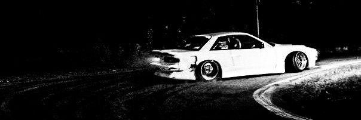
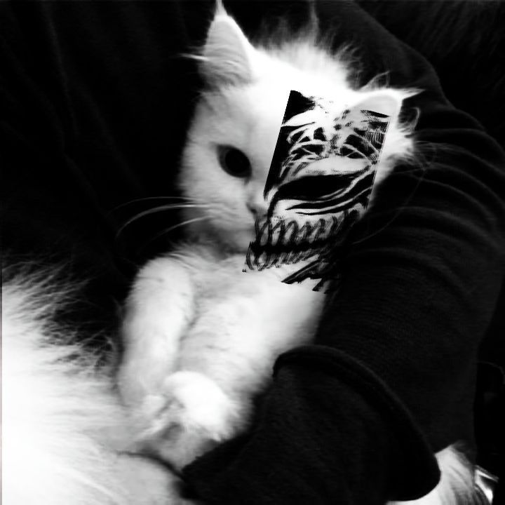

````md
<div align="center">



<br><br>


&nbsp;&nbsp;&nbsp;


# `xM4theus`

### `MIDNIGHT // NO SIGNAL`


</div>

---

## `// DRIVER`

```txt
           ID : xM4theus
       STATUS : ACTIVE
         TIME : 03:47 AM
     LOCATION : UNKNOWN
       SIGNAL : WEAK
        LIGHT : LOW
         MOOD : MIDNIGHT
````

```txt
> searching for destination...

ERROR:
destination not found.

> continue anyway? [Y/n]

Y
```

---

## `// LOADOUT`

<div align="center">


</div>

<br>

```txt
C++       ███████████░
C#        ███████████░
Lua       ██████████░░
Python    ████████░░░░
Shaders   ████████████
Sleep     ██░░░░░░░░░░
```

---

## `// CURRENT_ROUTE`

```txt
[ MIDNIGHT HIGHWAY ]

      ┌─────────────── GAME DEV
──────┤
      ├─────────────── SHADERS
──────┤
      ├─────────────── GRAPHICS
──────┤
      ├─────────────── LOW LEVEL
──────┤
      └─────────────── UNKNOWN
```

---

## `// TELEMETRY`

<div align="center">


</div>

<br>

<div align="center">


</div>

---

## `// RADIO`

```txt
CH. 01 ███████████████░   CODE
CH. 02 ████████████████   MUSIC
CH. 03 ███████░░░░░░░░░   REALITY
CH. 04 ████████████████   NIGHT
CH. ?? ▒▒▒▒▒▒▒▒▒▒▒▒▒▒▒▒   UNKNOWN
```

```txt
[03:41:16] SIGNAL ACQUIRED
[03:42:08] UNKNOWN TRANSMISSION
[03:43:51] SIGNAL LOST
[03:46:32] SIGNAL ACQUIRED
[03:47:00] don't look behind you
[03:47:01] SIGNAL LOST
```

---

## `// NIGHT_LOG`

```txt
03:12 — opened project
03:26 — changed one line
03:37 — everything broke
03:44 — fixed everything
03:45 — don't know why it works
03:47 — commit
```

---

<div align="center">

```txt
                 ⋆            .
         .                         ☾

                    xM4theus

              LOST // BUT MOVING

         .                         .
                  ⋆
```


<br><br>

`MIDNIGHT PURPLE`

`#050408` • `#171020` • `#38234B` • `#A77ADB` • `#E9A8C7` • `#F8F6FA`

<br>

### `drive until the signal disappears.`

</div>
```
